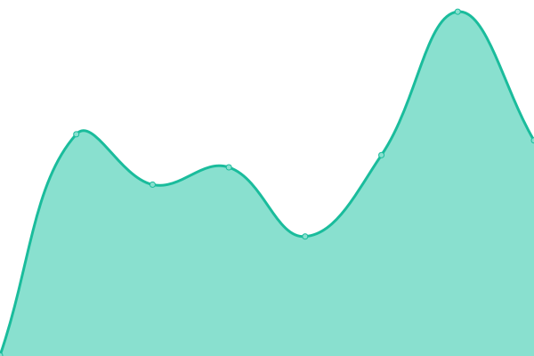
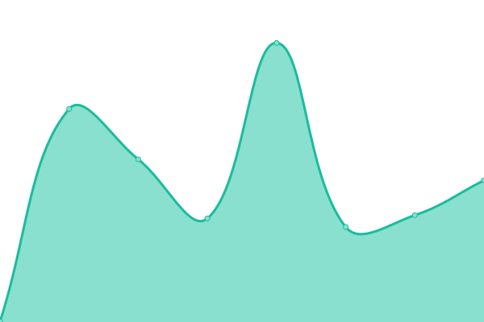
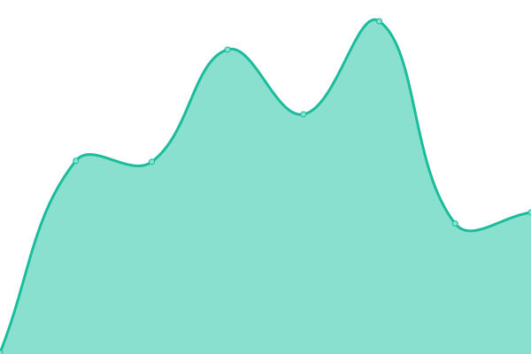
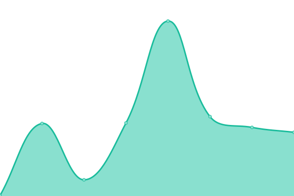
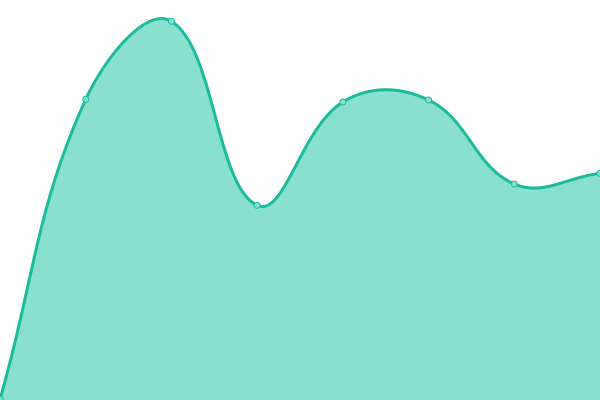

# [📈 Live Status](https://zYxDevs.github.io/status): <!--live status--> **🟧 Partial outage**

This repository contains the open-source uptime monitor and status page for [Yoga Pranata](https://www.otakufanshare.eu.org), powered by [Upptime](https://github.com/upptime/upptime).

With [Upptime](https://upptime.js.org), you can get your own unlimited and free uptime monitor and status page, powered entirely by a GitHub repository. We use [Issues](https://github.com/zYxDevs/status/issues) as incident reports, [Actions](https://github.com/zYxDevs/status/actions) as uptime monitors, and [Pages](https://zYxDevs.github.io/status) for the status page.

<!--start: status pages-->
<!-- This summary is generated by Upptime (https://github.com/upptime/upptime) -->
<!-- Do not edit this manually, your changes will be overwritten -->
<!-- prettier-ignore -->
| URL | Status | History | Response Time | Uptime |
| --- | ------ | ------- | ------------- | ------ |
|  [Personal Blog](https://www.isekai.eu.org) | 🟩 Up | [personal-blog.yml](https://github.com/zYxDevs/status/commits/HEAD/history/personal-blog.yml) | 

 258ms
     
 | 

<a href="https://status.isekai.eu.org/history/personal-blog">100.00%</a>
    

|  [Otaku Fanshare](https://www.otakufanshare.eu.org) | 🟩 Up | [otaku-fanshare.yml](https://github.com/zYxDevs/status/commits/HEAD/history/otaku-fanshare.yml) | 

 280ms
     
 | 

<a href="https://status.isekai.eu.org/history/otaku-fanshare">100.00%</a>
    

|  [zYxCloud](https://zyxdevs.eu.org) | 🟥 Down | [z-yx-cloud.yml](https://github.com/zYxDevs/status/commits/HEAD/history/z-yx-cloud.yml) | 

 205ms
     
 | 

<a href="https://status.isekai.eu.org/history/z-yx-cloud">0.00%</a>
    

|  [Wibu API](https://wibu-api.eu.org/api) | 🟩 Up | [wibu-api.yml](https://github.com/zYxDevs/status/commits/HEAD/history/wibu-api.yml) | 

 761ms
     
 | 

<a href="https://status.isekai.eu.org/history/wibu-api">100.00%</a>
    

|  [Wibu API Old](https://api.wibu-api.eu.org/api) | 🟩 Up | [wibu-api-old.yml](https://github.com/zYxDevs/status/commits/HEAD/history/wibu-api-old.yml) | 

 306ms
     
 | 

<a href="https://status.isekai.eu.org/history/wibu-api-old">100.00%</a>
    

|  [Janda RESTful API](https://janda.zyxdevs.eu.org) | 🟥 Down | [janda-res-tful-api.yml](https://github.com/zYxDevs/status/commits/HEAD/history/janda-res-tful-api.yml) | 

 147ms
     
 | 

<a href="https://status.isekai.eu.org/history/janda-res-tful-api">100.00%</a>
    

|  [Lust RESTful API](https://lust.zyxdevs.eu.org) | 🟥 Down | [lust-res-tful-api.yml](https://github.com/zYxDevs/status/commits/HEAD/history/lust-res-tful-api.yml) | 

 188ms
     
 | 

<a href="https://status.isekai.eu.org/history/lust-res-tful-api">100.00%</a>
    

|  [YoDrive](https://yodrive.eu.org) | 🟥 Down | [yo-drive.yml](https://github.com/zYxDevs/status/commits/HEAD/history/yo-drive.yml) | 

 476ms
     
 | 

<a href="https://status.isekai.eu.org/history/yo-drive">100.00%</a>
    

|  [zYxDrive](https://zyxdrive.eu.org) | 🟩 Up | [z-yx-drive.yml](https://github.com/zYxDevs/status/commits/HEAD/history/z-yx-drive.yml) | 

 374ms
     
 | 

<a href="https://status.isekai.eu.org/history/z-yx-drive">100.00%</a>
    

|  [zYxDrive [SA]](https://index.isekai.eu.org) | 🟩 Up | [z-yx-drive-sa.yml](https://github.com/zYxDevs/status/commits/HEAD/history/z-yx-drive-sa.yml) | 

 384ms
     
 | 

<a href="https://status.isekai.eu.org/history/z-yx-drive-sa">100.00%</a>
    

<!--end: status pages-->

[**Visit our status website →**](https://zYxDevs.github.io/status)

## 📄 License

- Powered by: [Upptime](https://github.com/upptime/upptime)
- Code: [MIT](./LICENSE) © [Yoga Pranata](https://www.otakufanshare.eu.org)
- Data in the `./history` directory: [Open Database License](https://opendatacommons.org/licenses/odbl/1-0/)
