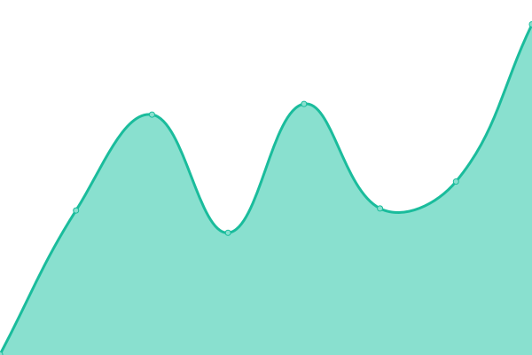

# [📈 Live Status](https://zYxDevs.github.io/status): <!--live status--> **🟧 Partial outage**

This repository contains the open-source uptime monitor and status page for [Yoga Pranata](https://www.otakufanshare.eu.org), powered by [Upptime](https://github.com/upptime/upptime).

With [Upptime](https://upptime.js.org), you can get your own unlimited and free uptime monitor and status page, powered entirely by a GitHub repository. We use [Issues](https://github.com/zYxDevs/status/issues) as incident reports, [Actions](https://github.com/zYxDevs/status/actions) as uptime monitors, and [Pages](https://zYxDevs.github.io/status) for the status page.

<!--start: status pages-->
<!-- This summary is generated by Upptime (https://github.com/upptime/upptime) -->
<!-- Do not edit this manually, your changes will be overwritten -->
<!-- prettier-ignore -->
| URL | Status | History | Response Time | Uptime |
| --- | ------ | ------- | ------------- | ------ |
|  [Personal Blog](https://www.isekai.eu.org) | 🟩 Up | [personal-blog.yml](https://github.com/zYxDevs/status/commits/HEAD/history/personal-blog.yml) | 

 226ms
     
 | 

<a href="https://status.isekai.eu.org/history/personal-blog">99.84%</a>
    

|  [Otaku Fanshare](https://www.otakufanshare.eu.org) | 🟥 Down | [otaku-fanshare.yml](https://github.com/zYxDevs/status/commits/HEAD/history/otaku-fanshare.yml) | 

 314ms
     
 | 

<a href="https://status.isekai.eu.org/history/otaku-fanshare">99.99%</a>
    

|  [IsekaiBin](https://paste.isekai.eu.org) | 🟩 Up | [isekai-bin.yml](https://github.com/zYxDevs/status/commits/HEAD/history/isekai-bin.yml) | 

 521ms
     
 | 

<a href="https://status.isekai.eu.org/history/isekai-bin">100.00%</a>
    

|  [Isekai Safelink](https://safe.isekai.eu.org) | 🟩 Up | [isekai-safelink.yml](https://github.com/zYxDevs/status/commits/HEAD/history/isekai-safelink.yml) | 

 1519ms
     
 | 

<a href="https://status.isekai.eu.org/history/isekai-safelink">99.75%</a>
    

|  [TorrentApi](https://torapi.isekai.eu.org) | 🟩 Up | [torrent-api.yml](https://github.com/zYxDevs/status/commits/HEAD/history/torrent-api.yml) | 

 2786ms
     
 | 

<a href="https://status.isekai.eu.org/history/torrent-api">99.72%</a>
    

|  [Screenshot Api](https://webshot.otakufanshare.eu.org) | 🟩 Up | [screenshot-api.yml](https://github.com/zYxDevs/status/commits/HEAD/history/screenshot-api.yml) | 

 219ms
     
 | 

<a href="https://status.isekai.eu.org/history/screenshot-api">99.84%</a>
    

|  [Kusonime API](https://kuso.otakufanshare.eu.org/api) | 🟩 Up | [kusonime-api.yml](https://github.com/zYxDevs/status/commits/HEAD/history/kusonime-api.yml) | 

 1810ms
     
 | 

<a href="https://status.isekai.eu.org/history/kusonime-api">100.00%</a>
    

|  [Wibu API](https://wibu-api.vercel.app/docs) | 🟩 Up | [wibu-api.yml](https://github.com/zYxDevs/status/commits/HEAD/history/wibu-api.yml) | 

 2327ms
     
 | 

<a href="https://status.isekai.eu.org/history/wibu-api">100.00%</a>
    

|  [Git Alert](http://galert.isekai.eu.org) | 🟥 Down | [git-alert.yml](https://github.com/zYxDevs/status/commits/HEAD/history/git-alert.yml) | 

 396ms
     
 | 

<a href="https://status.isekai.eu.org/history/git-alert">0.00%</a>
    

|  [YoDrive](https://yodrive.eu.org) | 🟥 Down | [yo-drive.yml](https://github.com/zYxDevs/status/commits/HEAD/history/yo-drive.yml) | 

 685ms
     
 | 

<a href="https://status.isekai.eu.org/history/yo-drive">100.00%</a>
    

|  [zYxDrive](https://zyxdrive.eu.org) | 🟩 Up | [z-yx-drive.yml](https://github.com/zYxDevs/status/commits/HEAD/history/z-yx-drive.yml) | 

 461ms
     
 | 

<a href="https://status.isekai.eu.org/history/z-yx-drive">100.00%</a>
    

|  [zYxDrive [SA]](https://index.isekai.eu.org) | 🟩 Up | [z-yx-drive-sa.yml](https://github.com/zYxDevs/status/commits/HEAD/history/z-yx-drive-sa.yml) | 

 369ms
     
 | 

<a href="https://status.isekai.eu.org/history/z-yx-drive-sa">100.00%</a>
    

|  [Ninym Server](18.198.138.41) | 🟥 Down | [ninym-server.yml](https://github.com/zYxDevs/status/commits/HEAD/history/ninym-server.yml) | 

 0ms
     
 | 

<a href="https://status.isekai.eu.org/history/ninym-server">0.00%</a>
    

|  [Mio Server](13.41.111.246) | 🟥 Down | [mio-server.yml](https://github.com/zYxDevs/status/commits/HEAD/history/mio-server.yml) | 

 0ms
     
 | 

<a href="https://status.isekai.eu.org/history/mio-server">100.00%</a>
    

<!--end: status pages-->

[**Visit our status website →**](https://zYxDevs.github.io/status)

## 📄 License

- Powered by: [Upptime](https://github.com/upptime/upptime)
- Code: [MIT](./LICENSE) © [Yoga Pranata](https://www.otakufanshare.eu.org)
- Data in the `./history` directory: [Open Database License](https://opendatacommons.org/licenses/odbl/1-0/)
